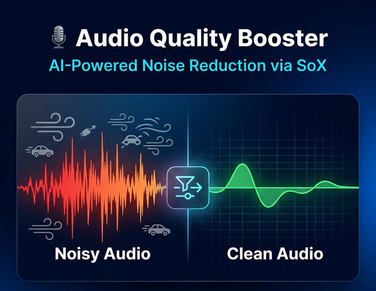

<div align="center">

# 🎙️ Audio Quality Booster
### *Professional Background Noise Removal Powered by SoX*

[](https://github.com/lakshan-bandara)
[](https://github.com/lakshan-bandara)
[](https://colab.research.google.com/github/lakshan-bandara/audio-quality-booster-sox/blob/main/Audio_Quality_Booster.ipynb)
[](https://python.org)
[](http://sox.sourceforge.net)
[](LICENSE)
[](https://wa.me/94768855659)

---

**Remove wind noise, traffic sounds, humming, and other background noise from your audio recordings instantly — no technical knowledge required!**

</div>

---

## 🖼️ Preview

<div align="center">
  
</div>

---

## ✨ Features

| Feature | Description |
|---------|-------------|
| 🌬️ **Wind Noise Removal** | Eliminate wind and air interference |
| 🚗 **Traffic Noise Filter** | Remove background vehicle sounds |
| 🔇 **Hum Reduction** | Clean electrical humming from recordings |
| 🎛️ **Adjustable Sensitivity** | Fine-tune how aggressively noise is removed |
| 🎧 **Live Preview** | Compare original vs cleaned audio in Colab |
| 📥 **One-Click Download** | Download your cleaned audio instantly |
| 🔊 **Audio Normalization** | Optional loudness normalization after cleaning |

---

## 🚀 Quick Start (Google Colab)

> No installation required! Runs entirely in your browser via Google Colab.

1. **Click the button below to open in Google Colab:**

<div align="center">

<a href="https://colab.research.google.com/github/lakshan-bandara/audio-quality-booster-sox/blob/main/Audio_Quality_Booster.ipynb">
  
</a>

</div>

2. Run **Step 1** to install SoX
3. Upload your noisy audio in **Step 2**
4. Generate a noise profile in **Step 3**
5. Apply noise reduction in **Step 4**
6. Preview & download in **Steps 5–6**

---

## 🛠️ How It Works

```
Upload Audio → Sample Noise → Build Profile → Filter Noise → Clean Audio
```

The tool uses **SoX (Sound eXchange)** — the "Swiss Army knife" of audio processing:

```bash
# Step 1: Generate noise profile from a silent/noisy section
sox input.wav -n trim 0 1.5 noiseprof noise.prof

# Step 2: Apply noise reduction
sox input.wav output.wav noisered noise.prof 0.21

# Step 3: (Optional) Normalize output loudness
sox input.wav output.wav noisered noise.prof 0.21 norm -3
```

### 🔧 Sensitivity Values Guide

| Value | Effect | Best For |
|-------|--------|----------|
| `0.10` | Light reduction | Slightly noisy recordings |
| `0.21` | **Balanced** *(default)* | Most recordings |
| `0.35` | Strong reduction | Very noisy environments |
| `0.50` | Aggressive | Heavy industrial noise |

> ⚠️ **Tip:** Too high sensitivity may also remove speech. Start at `0.21` and adjust.

---

## 📁 Project Structure

```
audio-quality-booster-sox/
│
├── 📓 Audio_Quality_Booster.ipynb   # Main Colab Notebook
├── assets/                          # Folder for project assets
│   └── view.png                      # Project preview image
├── 📄 README.md                     # This file
└── 📋 LICENSE                       # MIT License
```

---

## 💻 Local Installation (Optional)

If you prefer to run locally:

```bash
# Install SoX (Ubuntu/Debian)
sudo apt-get install sox libsox-fmt-all

# Install SoX (macOS with Homebrew)
brew install sox

# Install SoX (Windows - Download from)
# https://sourceforge.net/projects/sox/files/sox/

# Run noise reduction
sox input.wav output.wav noisered noise.prof 0.21
```

---

## 📌 Requirements

- **Google Account** (for Colab)
- **Audio file** in `.wav` format (MP3 can be converted)
- No local installation needed for Colab usage

---

## 🔄 Convert MP3 to WAV (if needed)

```bash
# Using ffmpeg
ffmpeg -i input.mp3 output.wav

# Using SoX
sox input.mp3 output.wav
```

---

## 📊 Before & After Example

| Property | Noisy Audio | Cleaned Audio |
|----------|-------------|---------------|
| Background Hum | ✅ Present | ❌ Removed |
| Wind Sound | ✅ Present | ❌ Removed |
| Voice Clarity | 🟡 Muffled | 🟢 Clear |
| SNR (Signal-to-Noise Ratio) | Low | High |

---

## 🤝 Contributing

Contributions are welcome! Feel free to:
- Open an **Issue** to report bugs or suggest features
- Fork the repo and submit a **Pull Request**
- ⭐ **Star** the repo if it helped you!

---

## 📜 License

This project is licensed under the **MIT License** — see the [LICENSE](LICENSE) file for details.

---

<div align="center">

*If this project helped you, consider giving it a* ⭐ *— it means a lot!*

</div>
